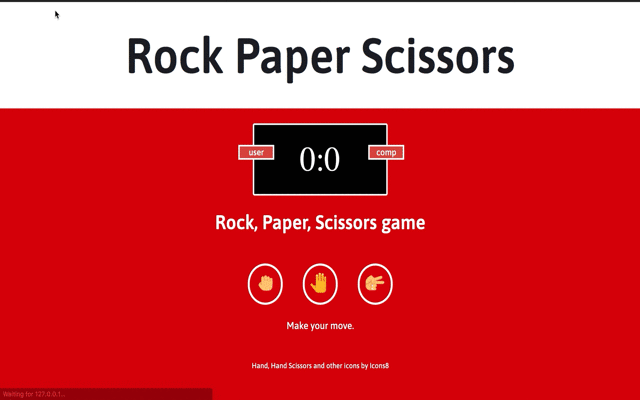

* This game was built as an exercise in utilizing Web Development Tutorial - JavaScript, HTML, CSS - freeCodeCamp tutorial.[here](https://youtu.be/jaVNP3nIAv0)

### Instructions

* Have users play the game 10 times, then show them their total scores.

**Rules for rock-paper-scissors**

* Rock: wins against scissors, loses to paper, and ties against itself.
* Paper: wins against rock, loses to scissors, and ties against itself.
* Scissors: wins against paper, loses to rock, and ties against itself.

* Icons by [https://icons8.com]
